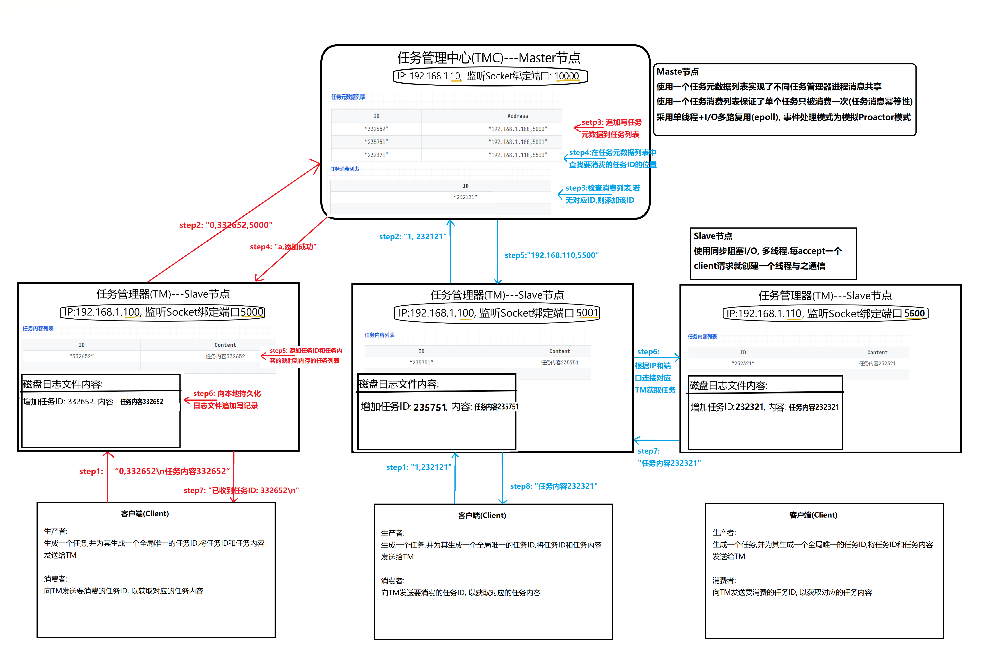

# Distributed-Task-Management-Center-BC

## 项目说明

### 背景

在一个典型的分布式任务处理系统中，存在着以下三个基础角色：

-   生产者，负责生成待处理任务；
-   消费者，即任务执行者，负责拉取并处理任务；
-   任务管理器，负责管理任务，保证任务被消费者执行，且一个任务仅被一个消费者获取。

### 预期目标

1.   编码实现生产者、消费者、任务管理器三个角色；
2.   任务管理器为多实例模式，可以在三台服务器上，各启动一个任务管理进程； 也可以在一台服务器上，启动三个任务管理进程；
3.   多个生产者可以同时将任务消息，推送到任意一个任务管理进程， 该消息被所有任务管理进程共享；
4.   多个消费者可以从同时任意一个任务管理进程获取该消息，比如：我们有A、B、C三个任务管理进程， 生产者将消息推送到进程A， 消费者可以从进程B或者进程C获取到该消息；
5.   消费者轮询、或者随机挑选任务管理进程拉取任务，依然保障： 任意生产者生成的任意一条消息，都只被一个消费者获取到，不存在消息被重复获取的情况。

### 项目难点

1.   不同角色的程序设计思路；
2.   保障单个消息只被消费一次的方案设计;
3.   重启不丢失任务的方案设计；
4.   多进程消息共享的设计思路。


## 目录描述

```shell
.
├── Client         
│   ├── a.out			// 客户端
│   ├── client.h		// TCP客户端类
│   └── main.cpp		// 客户端源文件
├── README.md
├── TaskManager
│   ├── a.out			// 任务管理器(TM)
│   ├── client.h		// TCP客户端类
│   ├── locker.h		// 互斥量封装类
│   ├── main.cpp		// TM源文件
│   ├── server.h		// TCP服务器类
│   ├── tasklist.txt	// 持久化记录文件
│   └── worker.h		// 处理请求的角色和任务列表
├── TaskManagerCenter
│   ├── a.out			// 任务管理中心(TMC)
│   ├── locker.h		// 互斥量封装类
│   ├── main.cpp		// TMC源文件
│   ├── threadpool.h	// 线程池类
│   ├── worker.h		// 处理请求的角色和元数据列表
│   ├── worklogic.cpp	// TMC业务逻辑头文件
│   └── worklogic.h		// TMC业务逻辑源文件
├── a.out
└── tasklist.txt

3 directories, 20 files
```


## 项目架构




## 执行过程说明

1.   启动任务管理中心(TMC)
     1.   切到`./TaskManagerCenter`目录下使用`g++ *.cpp -pthread`命令编译得到TMC的可执行文件
     2.   通过`./a.out 10000`启动TMC, 10000是其监听TM连接的端口号
2.   启动任务管理器进程(TM)
     1.   切到`./TaskManager`目录下使用`g++ main.cpp -pthread`编译得到TM的可执行文件
     2.   通过`./a.out <port>`启动TM, 选项port是其监听Client连接的端口号, 启动后会自动通过TMC的IP的地址和端口10000连接到TMC
3.   启动客户端(Client)
     1.   切到`./Client`目录下使用`g++ main.cpp`编译得到Client的可执行文件
     2.   通过`./a.out <role> <port>`连接指定port的TM, 选项role为0则启动的是生产者, 为1则启动为消费者


## 项目总结

目前该项目的预期目标已全部实现, 但仍有很多可以改进和升级的地方: 

1.   可以直接引入并使用Redis、kafka和zookeeper等中间件来实现分布式任务管理器
2.   需要考虑高并发情况下的负载均衡问题，以及读写分离、异步、解耦、削峰等优化思路的实现
3.   要保证生产者生产的任务ID全局唯一，可以再添加一个服务器，每当有生产者需要任务ID时访问该服务器获取，由该服务器统一分配和管理
4.   任务丢失问题，即消费者获取到了任务，任务管理器将该任务标记为已消费后，消费者在消费任务之前挂掉了。则该任务为被处理却被标记为已消费，任务丢失了。可以通过增加同步地多增加几个返回报文判断来解决，也可以用分布式事务的思想，整个消费过程是一个原子操作，失败后全部回滚。
5.   重启任务管理器，任务不丢失是通过模拟Redis的AOF持久化机制来实现的，也可以通过主从复制来进行备份。任务过多后本地的备份文件会越来越大，可以模仿GFS每隔一段时间创建一个CheckPoint。
6.   多任务管理器进程（TM）间消息共享是通过一个任务管理中心(TMC)（相当于GFS中的master节点）存储任务元数据来实现的，当有消费者向TM请求消费一个任务时，由TMC告诉该消费者该任务的内容存放在那个TM（此时TM相当于GFS中的chunkserver）上，消费者去连接相应的TM获取任务内容。也可以利用Redis中的哨兵模式，Cluster模式来实现该项目的架构。
7.   单个任务只被消费一次是通过TMC来统一管理和记录的。每当有消费者想消费某一任务时，先询问TMC该任务是否已被消费，若没有被消费，则上悲观锁（不允许其他消费者访问资源，但生产者可以继续生产），消费完毕后解锁。这个过程可以用Zookeeper分布式锁来实现。
8.   可以增加心跳机制来监控TM的状态
9.   由于并发较少，TMC现在只有一个，还没有考虑到主从复制时一致性的问题。但并发规模增大时，TMC应该有多个，应该考虑一致性问题：弱一致、最终一致。
10.   从CAP理论的角度来看，该项目现在是放弃了分区容忍性，即不进行分区，不考虑由于网络不通或结点挂掉的问题，实现了一致性和可用性（CA）。那么该系统将不是一个标准的分布式系统。将来考虑分区时，应该保证P和A，舍弃C强一致，保证最终一致性。
11.   进阶目标：基于分布式微服务架构，模块职责清晰，具备高扩展性；中心与agent侧指令互通时效性高、指令通道协议可扩展可快速替换；保持指令通道稳定性、安全性；考虑如何降低升级过程中对用户的影响。

